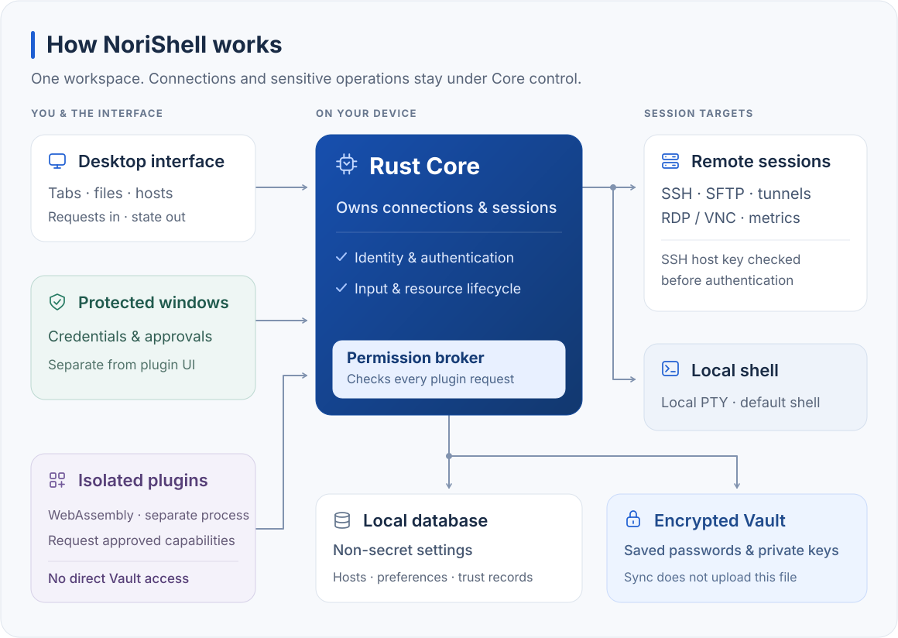

<p align="center">
  
</p>
<h1 align="center">NoriShell</h1>
<p align="center">
  <strong>Terminals, file transfers, and remote desktops. One workspace.</strong><br />
  SSH, local shells, SFTP, tunnels, RDP/VNC, and server monitoring on macOS and Windows. Organize hosts locally and protect saved credentials with an encrypted Vault.
</p>
<p align="center">
  <a href="https://github.com/Norixor/NoriShell/releases/latest"></a>
  <a href="https://github.com/Norixor/NoriShell/releases"></a>
  <a href="#installation-and-quick-start"></a>
  <a href="LICENSE"></a>
  <a href="https://github.com/Norixor/NoriShell/stargazers"></a>
</p>
<p align="center">
  <a href="https://github.com/Norixor/NoriShell/releases/latest">Download</a> ·
  <a href="docs/guides/README.md">Documentation</a> ·
  <a href="docs/guides/developers/README.en.md">Plugin development</a> ·
  <a href="https://github.com/Norixor/NoriShell/issues">Feedback</a>
</p>
<p align="center">English · <a href="README.zh-CN.md">简体中文</a></p>

## Contents

- [About](#about)
- [Installation and quick start](#installation-and-quick-start)
- [Key features](#key-features)
- [Preview](#preview)
- [Core and security](#core-and-security)
- [Documentation](#documentation)
- [Plugin development](#plugin-development)
- [Development from source](#development-from-source)
- [Troubleshooting](#troubleshooting)
- [Project layout](#project-layout)
- [License](#license)
- [Star History](#star-history)

## About

Working on a server often means switching between terminal tabs, file transfer windows, port forwarding settings, and remote desktop tools. NoriShell brings those tasks into one desktop workspace, with hosts and saved credentials managed on your device. It is built for day-to-day work across macOS and Windows, whether you manage one server or many.

## Installation and quick start

Latest release: **[v0.1.5](https://github.com/Norixor/NoriShell/releases/tag/v0.1.5)**. Choose an installer or a standalone ZIP for your device.

| Platform | Architecture | Installer | Standalone ZIP |
| --- | --- | --- | --- |
| macOS 13 or later | Apple Silicon (ARM64) | [Download DMG](https://github.com/Norixor/NoriShell/releases/download/v0.1.5/NoriShell_0.1.5_macos_arm64.dmg) | [Download ZIP](https://github.com/Norixor/NoriShell/releases/download/v0.1.5/NoriShell_0.1.5_macos_arm64.zip) |
| macOS 13 or later | Intel (x64) | [Download DMG](https://github.com/Norixor/NoriShell/releases/download/v0.1.5/NoriShell_0.1.5_macos_x64.dmg) | [Download ZIP](https://github.com/Norixor/NoriShell/releases/download/v0.1.5/NoriShell_0.1.5_macos_x64.zip) |
| Windows | x64 (Intel / AMD) | [Download setup](https://github.com/Norixor/NoriShell/releases/download/v0.1.5/NoriShell_0.1.5_windows_x64-setup.exe) | [Download ZIP](https://github.com/Norixor/NoriShell/releases/download/v0.1.5/NoriShell_0.1.5_windows_x64.zip) |
| Windows | ARM64 | [Download setup](https://github.com/Norixor/NoriShell/releases/download/v0.1.5/NoriShell_0.1.5_windows_arm64-setup.exe) | [Download ZIP](https://github.com/Norixor/NoriShell/releases/download/v0.1.5/NoriShell_0.1.5_windows_arm64.zip) |

For a macOS installer, drag NoriShell into Applications; on Windows, follow the installer. ZIP builds use the same local settings and data directories. Extract the full archive before running. The Windows ZIP requires WebView2 Runtime to be installed.

### First connection

1. On the Terminal page, choose **Quick Connect**, **Add Host**, or import an OpenSSH configuration.
2. Review the destination, port, route, and authentication method.
3. Confirm the server fingerprint on first use. If a trusted fingerprint changes, check the server before continuing.
4. Create or unlock the Vault when you want to save a password, private key, or key passphrase.
5. Once connected, open a terminal, transfer files, create a tunnel, or view the server overview.

### Check for updates

Open **Settings → About** and click “Check for updates”. The macOS and Windows installers can install stable updates in the app after you confirm. For ZIP builds and beta updates, download the file for your platform from [GitHub Releases](https://github.com/Norixor/NoriShell/releases).

## Key features

- **Terminal workspace.** Use SSH and local terminals in tabs and split panes, with search, reconnect, quick commands, keyword highlighting, and custom shortcuts.
- **Hosts and connection routes.** Organize hosts with groups, tags, favorites, and OpenSSH import. Connect with passwords, keys, or an SSH Agent through HTTP CONNECT / SOCKS5 proxies or SSH jump chains, with per-host algorithm settings.
- **Files and remote access.** Browse, transfer, preview, and edit files over SFTP. Open local, remote, or dynamic port forwarding, or connect to RDP / VNC desktops.
- **Server overview.** See host connection status and enable CPU, memory, network, and disk metrics where needed. Terminal, SFTP, forwarding, and monitoring connections remain independent.
- **Local data and security.** Keep passwords and private keys in the encrypted Vault. Confirm a server fingerprint on first SSH connection; a change to a trusted fingerprint blocks the connection. Telnet warns about plaintext traffic before connecting.
- **Plugins and themes.** Import or upgrade WebAssembly plugins from local ZIP files and approve their permissions. Theme plugins are supported.

For sync across devices, follow the [self-hosted sync guide](docs/guides/users/self-host-sync.en.md) to deploy the server and import the plugin. Upload from the first device, then select “Sync now” on the others. Restoring existing encrypted data requires that first device's Vault password.

## Preview


## Core and security



The Rust Core owns connections and checks server identity before SSH authentication; a changed trusted fingerprint blocks the connection. Saved secrets live in the encrypted Vault, while the local database holds non-secret settings. Plugins run in a separate process and request approved capabilities through the Core; they cannot read the Vault. Sync does not upload the local Vault file.

Report security issues privately through the channels in [SECURITY.md](SECURITY.md).

## Documentation

| Goal | Start here |
| --- | --- |
| Import plugins, manage permissions, or change appearance | [User guides](docs/guides/users/README.en.md) |
| Deploy sync and restore data on another device | [Self-hosted sync installation](docs/guides/users/self-host-sync.en.md) |
| Create, package, and upgrade plugins | [Plugin developer guide](docs/guides/developers/README.en.md) |
| Look up plugin APIs, events, and types | [Plugin API reference](docs/guides/plugin-api/README.en.md) |
| Explore internal desktop APIs | [Core API catalog](docs/guides/core-api/README.en.md) |

See the [complete documentation index](docs/guides/README.md) for more topics.

## Plugin development

Plugins use WebAssembly and can request access to networking, storage, tasks, and UI capabilities. Install and upgrade them by importing a local ZIP file.

Plugin development entry points:

- [Complete plugin developer guide](docs/guides/developers/README.en.md)
- [Build your first plugin](docs/guides/developers/start/quickstart.en.md)
- [Call APIs and request permissions](docs/guides/developers/development/calling-api.en.md)
- [Build plugin interfaces](docs/guides/developers/development/ui.en.md)
- [Manage tasks and resources](docs/guides/developers/development/resources.en.md)
- [Package, install, and upgrade](docs/guides/developers/development/packaging.en.md)
- [API methods and types](docs/guides/plugin-api/README.en.md)
- [Example walkthroughs and source](docs/guides/developers/examples/README.en.md)
- [Self-hosted sync plugin and Go server](example/self-host-sync/readme.md)

More topics: [Wasm ABI](docs/guides/developers/wasm-abi.en.md) · [Theme plugins](docs/guides/developers/themes.en.md) · [Security and release checks](docs/guides/developers/security.en.md) · [SDK tooling](examples/plugins/sdk-tooling/README.md)

## Development from source

### Prerequisites

NoriShell uses Tauri 2, Vue 3, TypeScript, xterm, and Rust.

- Node.js **22 or newer**.
- pnpm **10.32.1**, matching `packageManager` in `package.json`.
- Rust **1.97.1**, pinned by `rust-toolchain.toml`, with `rustfmt` and `clippy`.
- [Tauri 2 platform prerequisites](https://v2.tauri.app/start/prerequisites/): Xcode Command Line Tools on macOS; MSVC C++ build tools and WebView2 on Windows.

### Run locally

```sh
git clone https://github.com/Norixor/NoriShell.git
cd NoriShell
pnpm install --frozen-lockfile
pnpm tauri dev
```

### Checks and builds

```sh
# Check types, lint, and frontend tests, then build the frontend
pnpm check

# Rust formatting, tests, and strict static analysis
cargo fmt --all -- --check
cargo test --workspace --all-targets --locked
cargo clippy --workspace --all-targets --locked -- -D warnings

# Build the desktop application for the current platform
pnpm tauri build
```

## Troubleshooting

### macOS reports that the app is damaged

If macOS blocks an unsigned app or an app with a remaining quarantine attribute, run these commands in Terminal:

```sh
sudo spctl --master-disable
sudo xattr -r -d com.apple.quarantine "/Applications/NoriShell.app"
```

Then open NoriShell again.

### Local build environment differs

Use the pnpm and Rust versions pinned by the repository. If dependencies are inconsistent, run `pnpm install --frozen-lockfile` again. On macOS, also verify the Xcode Command Line Tools and license state before the first build.

## Project layout

```text
src/                    Vue UI and shared components
src-tauri/              Tauri desktop entry point and native windows
crates/                 Rust Core, protocols, Vault, persistence, and plugin capabilities
docs/guides/            User, plugin development, Plugin API, and Core API documentation
examples/plugins/       Wasm plugin and SDK examples
example/self-host-sync/ Self-hosted sync plugin and Go server
examples/theme-plugins/ Declarative theme examples
vendor/                 Third-party dependency patches
```

See [vendor/README.md](vendor/README.md) for the origin, licensing, and modification scope of vendored patches.

## License

Original NoriShell code is licensed under the **GNU General Public License v3.0 only (GPL-3.0-only)**. See [LICENSE](LICENSE) for the complete terms.

Third-party source code, dependencies, and assets retain their respective licenses. See [THIRD-PARTY-NOTICES.md](THIRD-PARTY-NOTICES.md).

## Star History

<a href="https://www.star-history.com/?repos=norixor%2Fnorishell&type=date&legend=top-left">
  <picture>
    <source media="(prefers-color-scheme: dark)" srcset="https://api.star-history.com/chart?repos=norixor/norishell&type=date&theme=dark&legend=top-left" />
    <source media="(prefers-color-scheme: light)" srcset="https://api.star-history.com/chart?repos=norixor/norishell&type=date&legend=top-left" />
    
  </picture>
</a>
