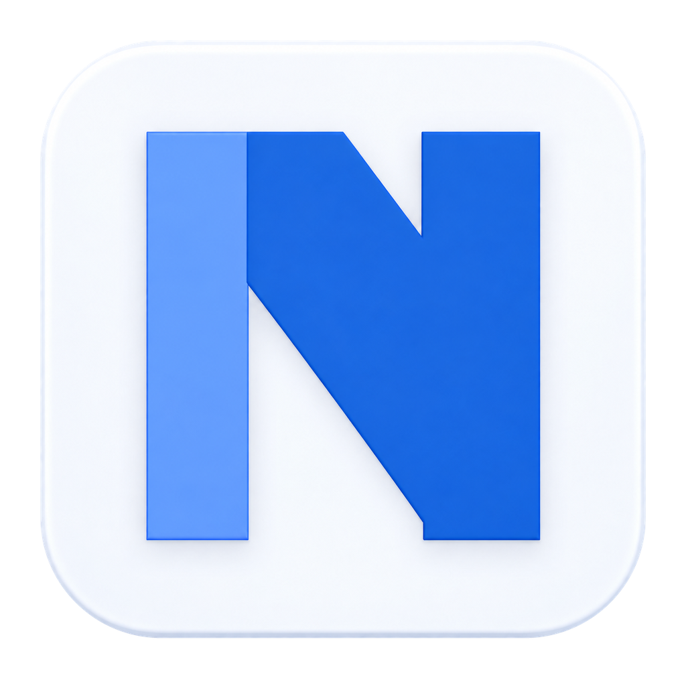
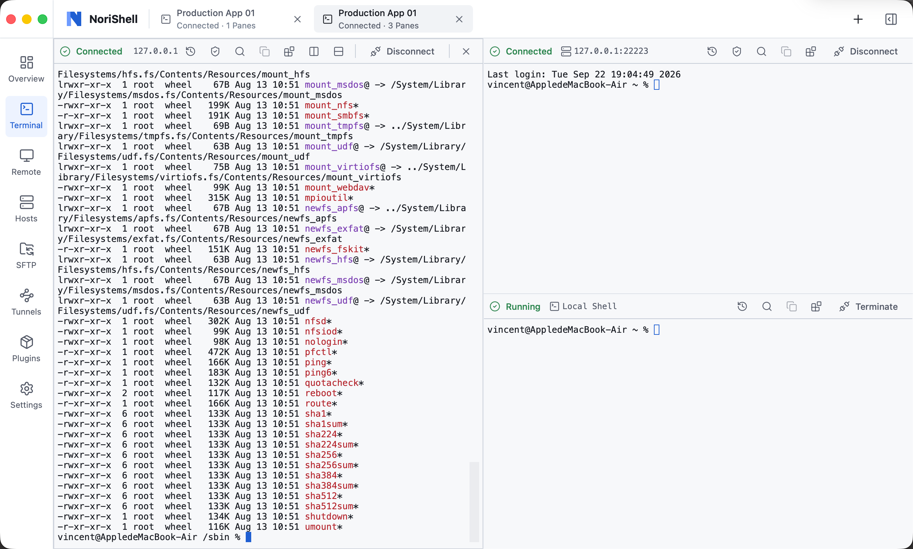

<p align="center">
  
</p>
<h1 align="center">NoriShell</h1>
<p align="center">本地优先的终端与远程连接工作台</p>
<p align="center">SSH · 本地终端 · SFTP · 端口转发 · RDP / VNC · 加密 Vault · 插件</p>
<p align="center"><a href="LICENSE">GPL-3.0-only</a> · macOS / Windows</p>
<p align="center">简体中文 · <a href="README.en.md">English</a></p>

NoriShell 将终端会话、远程连接、文件传输、远程桌面和凭据管理放进一个桌面应用。基础连接无需账号，主机配置保存在本机，持久化密码和私钥进入独立加密 Vault；需要跨设备使用时，可通过 Norixor 插件或[自建同步示例](example/self-host-sync/readme.md)选择性启用端到端加密同步。

<p align="center">
  <a href="https://github.com/Norixor/NoriShell/releases/latest"><strong>下载 NoriShell</strong></a>
  · <a href="#安装与快速开始">查看安装说明</a>
</p>

项目基于 **Tauri 2、Vue 3、TypeScript、xterm 和 Rust**。Rust Core 管理连接、秘密、持久化和资源生命周期，前端负责交互与可重建的状态投影。

## 目录

- [亮点](#亮点)
- [界面预览](#界面预览)
- [功能](#功能)
- [安装与快速开始](#安装与快速开始)
- [从源码开发](#从源码开发)
- [本地优先与安全边界](#本地优先与安全边界)
- [插件开发](#插件开发)
- [文档](#文档)
- [故障排查](#故障排查)
- [架构与项目结构](#架构与项目结构)
- [许可证](#许可证)
- [Star History](#star-history)

## 亮点

- **一个窗口管理远程工作。** 在同一个窗口切换终端、主机、文件传输、隧道、服务器概览和远程桌面。
- **本地优先。** SSH、本地终端、SFTP、隧道和本机配置不依赖云端账号。
- **明确的身份与秘密边界。** 首次 SSH 指纹需要确认，密钥变化会阻断连接，持久秘密只进入加密 Vault。
- **连接互不干扰。** 终端、文件传输、隧道和监控独立运行，关闭其中一项不会中断其他连接。
- **受限插件系统。** 插件使用隔离的 WebAssembly Host、细粒度 capability 和受保护授权；安装与升级均由用户明确导入本地 ZIP。
- **面向 macOS 与 Windows。** 提供 macOS Apple Silicon / Intel、Windows x64 和 Windows ARM64 安装包。

需要多端同步时，可按[自建同步指南](docs/guides/users/self-host-sync.zh-CN.md)部署服务端并导入插件。在第一台设备确认上传，再在其他设备点击“立即同步”审阅恢复；恢复已有加密数据时，需要最初上传设备的 Vault 密码。同步范围与冲突处理也见该指南。

## 界面预览



## 功能

| 能力 | 说明 |
| --- | --- |
| SSH 与本地终端 | 多标签、嵌套分屏、搜索、重连、最近连接，以及独立的本地 Shell / PTY 会话 |
| 主机与连接管理 | 分组、标签、收藏、OpenSSH 非秘密配置导入、密码/密钥/Agent 认证和服务器指纹核验 |
| 路由与兼容策略 | Direct、HTTP CONNECT、SOCKS5、Jump Host / Host Chain，以及按 Host 隔离的算法例外 |
| 文件与网络 | 多 Pane SFTP 浏览、传输、预览/编辑、实时追踪，以及 Local / Remote / Dynamic 端口转发 |
| 远程桌面 | RDP / VNC 配置与会话、SSH 网关、缩放、输入、文本剪贴板和 RDP 音频能力 |
| 服务器概览 | 按 Host 聚合 Terminal、SFTP、Tunnel 和 Metrics，可选采集 CPU、内存、网络与磁盘指标 |
| 凭据保护 | 独立加密 Vault、一次性凭据、受保护窗口、严格的 host-key 确认与变化阻断 |
| 日常操作 | 快捷命令、自定义快捷键、关键词高亮、通知、托盘面板和设置导入导出 |
| 插件与主题 | 隔离的 WebAssembly 插件、细粒度权限、本地 ZIP 导入/升级和纯数据声明式主题 |
| 可选同步 | 通过 Norixor 插件或自建服务同步可移植 SSH、远程桌面配置与非秘密偏好，不上传本机 Vault 文件 |
| Telnet | 独立 Telnet 会话；连接前明确提示明文传输、无服务器身份验证和链路篡改风险 |

## 安装与快速开始

前往 [GitHub Releases](https://github.com/Norixor/NoriShell/releases)，选择适合设备的安装包或免安装 ZIP。

| 平台 | 架构 | 安装包 | 免安装 ZIP |
| --- | --- | --- | --- |
| macOS 13 及以上 | Apple Silicon（ARM64） | `.dmg` | 解压后打开 `NoriShell.app` |
| macOS 13 及以上 | Intel（x64） | `.dmg` | 解压后打开 `NoriShell.app` |
| Windows | x64（Intel / AMD） | `-setup.exe` | 解压完整文件夹后运行 `norishell.exe` |
| Windows | ARM64 | `-setup.exe` | 解压完整文件夹后运行 `norishell.exe` |

使用 macOS 安装包时，将 NoriShell 拖入“应用程序”；Windows 安装包按向导安装。ZIP 版使用同样的本机配置与数据目录，运行前请完整解压。Windows ZIP 版需要系统已安装 WebView2 Runtime。

### 检查新版本

在 **设置 → 关于** 中点击“检查更新”。发现新版本后，可打开 [GitHub Releases](https://github.com/Norixor/NoriShell/releases) 选择对应平台的安装包。正式版本的 macOS 应用和 Windows 安装版也可在确认后由应用下载并安装签名更新；Windows 免安装 ZIP 版以及 Beta 更新需手动下载。Beta 版本可检测后续 Beta 和正式版本；正式版本只提示正式发布。

### 首次连接

1. 从 Terminal 空状态选择 **Quick Connect**、添加 Host 或导入 OpenSSH 配置。
2. 核对目标地址、端口、路由和认证方式。
3. 首次连接时确认服务器 host key 算法与指纹；已信任密钥变化时停止并核对服务器。
4. 需要保存密码、私钥或 passphrase 时创建或解锁 Vault。
5. 连接成功后按需打开新的 Terminal、SFTP、Tunnel 或 Overview 监控；这些资源彼此独立。

## 从源码开发

### 环境要求

- Node.js **22 或更新版本**。
- pnpm **10.32.1**，与 `package.json` 中的 `packageManager` 一致。
- Rust **1.97.1**，由 `rust-toolchain.toml` 固定，并包含 `rustfmt` 与 `clippy`。
- [Tauri 2 平台依赖](https://v2.tauri.app/start/prerequisites/)：macOS 需要 Xcode Command Line Tools；Windows 需要 MSVC C++ 构建工具和 WebView2。

### 本地启动

```sh
git clone https://github.com/Norixor/NoriShell.git
cd NoriShell
pnpm install --frozen-lockfile
pnpm tauri dev
```

### 检查与构建

```sh
# 生成契约一致性、类型检查、Lint、前端测试和生产构建
pnpm check

# Rust 格式、测试和严格静态检查
cargo fmt --all -- --check
cargo test --workspace --all-targets --locked
cargo clippy --workspace --all-targets --locked -- -D warnings

# 构建当前平台的桌面应用
pnpm tauri build
```

## 本地优先与安全边界

- **秘密只进入 Vault。** 持久化密码、私钥和 passphrase 不作为普通 SQLite 配置或日志保存。
- **连接前核验服务器身份。** 首次 SSH 指纹需要明确确认；已信任密钥变化时连接被阻断。
- **不同资源拥有独立连接。** Terminal、SFTP、Tunnel 与 Metrics 不共享 SSH transport。
- **插件默认无权限。** guest 不能直接读取 Vault、SQLite、SSH socket、宿主 DOM 或任意 Tauri command。
- **敏感决定使用受保护窗口。** Vault、凭据、host key、插件授权和其他安全确认与普通插件界面隔离。
- **同步内容由用户选择。** 同步服务不获得 Vault 密码、KEK、VMK、Known Hosts 或设备自动解锁材料。

安全问题请通过 [SECURITY.md](SECURITY.md) 中的渠道私密报告。

## 插件开发

插件使用版本化、受限的 WebAssembly ABI，通过宿主的类型化 Broker 请求网络、存储、任务、UI 或协议资源。声明 capability 只是申请权限，不能绕过用户授权、资源范围、generation 栅栏或宿主生命周期。

NoriShell 不提供在线插件市场。安装或升级插件时，用户明确选择本地 ZIP；同一插件的更高版本沿用包校验、权限重新审阅、版本防回退和原子替换流程。

插件开发入口：

- [完整插件开发指南](docs/guides/developers/README.zh-CN.md)
- [从零创建第一个插件](docs/guides/developers/start/quickstart.zh-CN.md)
- [调用 API 与申请权限](docs/guides/developers/development/calling-api.zh-CN.md)
- [构建插件界面](docs/guides/developers/development/ui.zh-CN.md)
- [管理任务与资源](docs/guides/developers/development/resources.zh-CN.md)
- [打包、安装与升级](docs/guides/developers/development/packaging.zh-CN.md)
- [API 方法与类型参考](docs/guides/plugin-api/README.zh-CN.md)
- [示例讲解与源码](docs/guides/developers/examples/README.zh-CN.md)
- [自建同步插件与 Go 服务端](example/self-host-sync/readme.md)

更多专题：[Wasm ABI](docs/guides/developers/wasm-abi.zh-CN.md) · [主题插件](docs/guides/developers/themes.zh-CN.md) · [安全与发布检查](docs/guides/developers/security.zh-CN.md) · [SDK 开发工具](examples/plugins/sdk-tooling/README.md)

## 文档

| 文档目录 | 面向对象与边界 |
| --- | --- |
| [完整文档目录](docs/guides/README.md) | 中英文总入口 |
| [用户指南](docs/guides/users/README.zh-CN.md) | 插件导入、权限、恢复与外观 |
| [自建同步安装指南](docs/guides/users/self-host-sync.zh-CN.md) | 服务端配置、插件导入与首次同步 |
| [开发指南](docs/guides/developers/README.zh-CN.md) | 包开发、ABI、Broker、UI、主题和安全检查 |
| [Plugin API 参考](docs/guides/plugin-api/README.zh-CN.md) | guest 可调用的协议、类型、能力、资源与事件 |
| [Core API 目录](docs/guides/core-api/README.zh-CN.md) | 应用 renderer IPC、commands、events、handlers 与 Plugin Host；不是插件权限面 |

## 故障排查

### macOS 提示“应用已损坏”

如果 macOS 拦截未签名或隔离属性残留的应用，可以在终端中依次执行：

```sh
sudo spctl --master-disable
sudo xattr -r -d com.apple.quarantine "/Applications/NoriShell.app"
```

然后重新打开 NoriShell。

### 本地构建环境不一致

优先使用仓库固定的 pnpm 与 Rust 版本。依赖异常时先重新执行 `pnpm install --frozen-lockfile`；macOS 首次构建同时核对 Xcode Command Line Tools 和许可状态。

## 架构与项目结构

```text
Vue Desktop UI
    │ typed Tauri commands / channels / events
Rust Core
    ├── SSH、PTY、SFTP、Tunnel、Metrics 与远程桌面生命周期
    ├── SQLite 非秘密元数据 + 独立加密 Vault
    └── 插件包校验、权限 Broker 与资源围栏
        │ versioned plugin protocol
Isolated Plugin Host
    └── 单一受限 Wasm，无直接 Vault、SQLite、socket 或 Tauri 访问
```

```text
src/                    Vue 界面、状态投影与共享组件
src-tauri/              Tauri 桌面入口、原生窗口与宿主集成
crates/                 Rust Core、协议、Vault、持久化和插件能力
docs/guides/            用户、插件开发、Plugin API 与 Core API 文档
examples/plugins/       Wasm 插件与 SDK 示例
example/self-host-sync/ 自建同步插件、Go 服务端与 Release 打包脚本
examples/theme-plugins/ 声明式主题示例
vendor/                 保留上游许可和修改说明的依赖补丁
```

第三方补丁的来源、许可和修改范围见 [vendor/README.md](vendor/README.md)。

## 许可证

NoriShell 原创代码采用 **GNU General Public License v3.0 only（GPL-3.0-only）**。完整条款见 [LICENSE](LICENSE)。使用、修改或分发受 GPL 覆盖的版本时，须履行相应的源码提供及其他许可义务。

第三方源码、依赖和素材保留各自许可，见 [THIRD-PARTY-NOTICES.md](THIRD-PARTY-NOTICES.md)。

## Star History

<a href="https://www.star-history.com/?repos=norixor%2Fnorishell&type=date&legend=top-left">
  <picture>
    <source media="(prefers-color-scheme: dark)" srcset="https://api.star-history.com/chart?repos=norixor/norishell&type=date&theme=dark&legend=top-left" />
    <source media="(prefers-color-scheme: light)" srcset="https://api.star-history.com/chart?repos=norixor/norishell&type=date&legend=top-left" />
    
  </picture>
</a>
