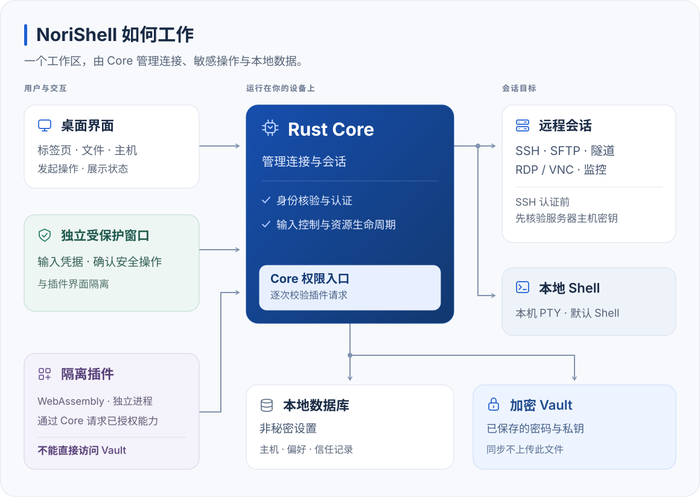

<p align="center">
  
</p>
<h1 align="center">NoriShell</h1>
<p align="center">
  <strong>终端、文件传输与远程桌面，一个工作区。</strong><br />
  在 macOS 和 Windows 上统一使用 SSH、本地终端、SFTP、隧道、RDP/VNC 与服务器概览。主机信息保存在本机，已保存凭据由加密 Vault 保护。
</p>
<p align="center">
  <a href="https://github.com/Norixor/NoriShell/releases/latest"></a>
  <a href="https://github.com/Norixor/NoriShell/releases"></a>
  <a href="#安装与快速开始"></a>
  <a href="LICENSE"></a>
  <a href="https://github.com/Norixor/NoriShell/stargazers"></a>
</p>
<p align="center">
  <a href="https://github.com/Norixor/NoriShell/releases/latest">下载</a> ·
  <a href="docs/guides/README.md">文档</a> ·
  <a href="docs/guides/developers/README.zh-CN.md">插件开发</a> ·
  <a href="https://github.com/Norixor/NoriShell/issues">反馈问题</a>
</p>
<p align="center"><a href="README.md">English</a> · 简体中文</p>

## 目录

- [关于 NoriShell](#关于-norishell)
- [安装与快速开始](#安装与快速开始)
- [特性](#特性)
- [界面预览](#界面预览)
- [Core 与安全](#core-与安全)
- [文档](#文档)
- [插件开发](#插件开发)
- [从源码开发](#从源码开发)
- [故障排查](#故障排查)
- [项目结构](#项目结构)
- [许可证](#许可证)
- [Star History](#star-history)

## 关于 NoriShell

管理服务器时，终端、文件传输、端口转发和远程桌面往往分散在不同工具中。NoriShell 将这些操作放进同一个桌面工作区，主机信息与已保存的凭据由你的设备管理。无论是一台还是多台服务器，都可以在 macOS 和 Windows 上使用。

## 安装与快速开始

当前版本：**[v0.1.4](https://github.com/Norixor/NoriShell/releases/tag/v0.1.4)**。按设备选择安装包或免安装 ZIP。

| 平台 | 架构 | 安装包 | 免安装 ZIP |
| --- | --- | --- | --- |
| macOS 13 及以上 | Apple Silicon（ARM64） | [下载 DMG](https://github.com/Norixor/NoriShell/releases/download/v0.1.4/NoriShell_0.1.4_macos_arm64.dmg) | [下载 ZIP](https://github.com/Norixor/NoriShell/releases/download/v0.1.4/NoriShell_0.1.4_macos_arm64.zip) |
| macOS 13 及以上 | Intel（x64） | [下载 DMG](https://github.com/Norixor/NoriShell/releases/download/v0.1.4/NoriShell_0.1.4_macos_x64.dmg) | [下载 ZIP](https://github.com/Norixor/NoriShell/releases/download/v0.1.4/NoriShell_0.1.4_macos_x64.zip) |
| Windows | x64（Intel / AMD） | [下载安装包](https://github.com/Norixor/NoriShell/releases/download/v0.1.4/NoriShell_0.1.4_windows_x64-setup.exe) | [下载 ZIP](https://github.com/Norixor/NoriShell/releases/download/v0.1.4/NoriShell_0.1.4_windows_x64.zip) |
| Windows | ARM64 | [下载安装包](https://github.com/Norixor/NoriShell/releases/download/v0.1.4/NoriShell_0.1.4_windows_arm64-setup.exe) | [下载 ZIP](https://github.com/Norixor/NoriShell/releases/download/v0.1.4/NoriShell_0.1.4_windows_arm64.zip) |

使用 macOS 安装包时，将 NoriShell 拖入“应用程序”；Windows 安装包按向导安装。ZIP 版使用同样的本机配置与数据目录，运行前请完整解压。Windows ZIP 版需要系统已安装 WebView2 Runtime。

### 首次连接

1. 在终端页选择**快速连接**、**添加主机**，或导入 OpenSSH 配置。
2. 核对目标地址、端口、路由和认证方式。
3. 首次连接时确认服务器指纹；如果已信任的指纹发生变化，先核对服务器。
4. 需要保存密码、私钥或私钥口令时，创建或解锁 Vault。
5. 连接成功后，就可以打开终端、传输文件、创建隧道或查看服务器概览。

### 检查新版本

在 **设置 → 关于** 中点击“检查更新”。macOS 和 Windows 安装版可按提示在应用内安装正式版更新；ZIP 版和 Beta 更新请到 [GitHub Releases](https://github.com/Norixor/NoriShell/releases) 下载对应平台的文件。

## 特性

- **终端工作区。** 在多标签与分屏中使用 SSH 或本地终端，支持搜索、重连、快捷命令、关键词高亮和自定义快捷键。
- **主机与连接管理。** 通过分组、标签、收藏和 OpenSSH 配置导入管理主机；支持密码、密钥和 Agent 认证，以及 HTTP CONNECT / SOCKS5 代理、SSH 跳板链和主机级算法设置。
- **文件与远程访问。** 使用 SFTP 浏览、传输、预览和编辑文件；按需开启本地、远程或动态端口转发，或通过 RDP / VNC 连接远程桌面。
- **服务器概览。** 查看主机连接状态，并为需要监控的主机启用 CPU、内存、网络和磁盘指标。终端、SFTP、转发和监控连接彼此独立。
- **本地数据与安全。** 密码和私钥保存在加密 Vault 中；首次 SSH 连接确认服务器指纹，已信任指纹变化时阻断连接。Telnet 会在连接前提示明文传输风险。
- **插件与主题。** 通过本地 ZIP 导入或升级 WebAssembly 插件，使用前审批所需权限；可安装主题插件。

如需多端同步，按[自建同步指南](docs/guides/users/self-host-sync.zh-CN.md)部署服务端并导入插件。在第一台设备上传后，于其他设备点击“立即同步”；恢复已有加密数据需要首次上传设备的 Vault 密码。

## 界面预览


## Core 与安全



Rust Core 管理连接，在 SSH 认证前核验服务器身份；已信任的指纹发生变化时会阻断连接。已保存的秘密存放在加密 Vault 中，本地数据库保存非秘密设置。插件在独立进程中运行，只能通过 Core 请求已授权的能力，不能读取 Vault。同步不会上传本机 Vault 文件。

安全问题请通过 [SECURITY.md](SECURITY.md) 中的渠道私密报告。

## 文档

| 想要做什么 | 从这里开始 |
| --- | --- |
| 导入插件、管理权限或设置外观 | [用户指南](docs/guides/users/README.zh-CN.md) |
| 部署同步服务并在其他设备恢复数据 | [自建同步安装指南](docs/guides/users/self-host-sync.zh-CN.md) |
| 创建、打包和升级插件 | [插件开发指南](docs/guides/developers/README.zh-CN.md) |
| 查询插件可用的接口、事件和类型 | [Plugin API 参考](docs/guides/plugin-api/README.zh-CN.md) |
| 查阅桌面应用内部接口 | [Core API 目录](docs/guides/core-api/README.zh-CN.md) |

更多页面见[完整文档目录](docs/guides/README.md)。

## 插件开发

插件使用 WebAssembly，可按授权使用网络、存储、任务、界面等能力。安装和升级均通过本地 ZIP 导入。

插件开发入口：

- [完整插件开发指南](docs/guides/developers/README.zh-CN.md)
- [从零创建第一个插件](docs/guides/developers/start/quickstart.zh-CN.md)
- [调用 API 与申请权限](docs/guides/developers/development/calling-api.zh-CN.md)
- [构建插件界面](docs/guides/developers/development/ui.zh-CN.md)
- [管理任务与资源](docs/guides/developers/development/resources.zh-CN.md)
- [打包、安装与升级](docs/guides/developers/development/packaging.zh-CN.md)
- [API 方法与类型参考](docs/guides/plugin-api/README.zh-CN.md)
- [示例讲解与源码](docs/guides/developers/examples/README.zh-CN.md)
- [自建同步插件与 Go 服务端](example/self-host-sync/readme.md)

更多专题：[Wasm ABI](docs/guides/developers/wasm-abi.zh-CN.md) · [主题插件](docs/guides/developers/themes.zh-CN.md) · [安全与发布检查](docs/guides/developers/security.zh-CN.md) · [SDK 开发工具](examples/plugins/sdk-tooling/README.md)

## 从源码开发

### 环境要求

项目使用 Tauri 2、Vue 3、TypeScript、xterm 和 Rust。

- Node.js **22 或更新版本**。
- pnpm **10.32.1**，与 `package.json` 中的 `packageManager` 一致。
- Rust **1.97.1**，由 `rust-toolchain.toml` 固定，并包含 `rustfmt` 与 `clippy`。
- [Tauri 2 平台依赖](https://v2.tauri.app/start/prerequisites/)：macOS 需要 Xcode Command Line Tools；Windows 需要 MSVC C++ 构建工具和 WebView2。

### 本地启动

```sh
git clone https://github.com/Norixor/NoriShell.git
cd NoriShell
pnpm install --frozen-lockfile
pnpm tauri dev
```

### 检查与构建

```sh
# 检查类型、Lint 和前端测试，并构建前端
pnpm check

# Rust 格式、测试和严格静态检查
cargo fmt --all -- --check
cargo test --workspace --all-targets --locked
cargo clippy --workspace --all-targets --locked -- -D warnings

# 构建当前平台的桌面应用
pnpm tauri build
```

## 故障排查

### macOS 提示“应用已损坏”

如果 macOS 拦截未签名或隔离属性残留的应用，可以在终端中依次执行：

```sh
sudo spctl --master-disable
sudo xattr -r -d com.apple.quarantine "/Applications/NoriShell.app"
```

然后重新打开 NoriShell。

### 本地构建环境不一致

优先使用仓库固定的 pnpm 与 Rust 版本。依赖异常时先重新执行 `pnpm install --frozen-lockfile`；macOS 首次构建同时核对 Xcode Command Line Tools 和许可状态。

## 项目结构

```text
src/                    Vue 界面与共享组件
src-tauri/              Tauri 桌面入口与原生窗口
crates/                 Rust Core、协议、Vault、持久化和插件能力
docs/guides/            用户、插件开发、Plugin API 与 Core API 文档
examples/plugins/       Wasm 插件与 SDK 示例
example/self-host-sync/ 自建同步插件与 Go 服务端
examples/theme-plugins/ 声明式主题示例
vendor/                 第三方依赖补丁
```

第三方补丁的来源、许可和修改范围见 [vendor/README.md](vendor/README.md)。

## 许可证

NoriShell 原创代码采用 **GNU General Public License v3.0 only（GPL-3.0-only）**，完整条款见 [LICENSE](LICENSE)。

第三方源码、依赖和素材保留各自许可，见 [THIRD-PARTY-NOTICES.md](THIRD-PARTY-NOTICES.md)。

## Star History

<a href="https://www.star-history.com/?repos=norixor%2Fnorishell&type=date&legend=top-left">
  <picture>
    <source media="(prefers-color-scheme: dark)" srcset="https://api.star-history.com/chart?repos=norixor/norishell&type=date&theme=dark&legend=top-left" />
    <source media="(prefers-color-scheme: light)" srcset="https://api.star-history.com/chart?repos=norixor/norishell&type=date&legend=top-left" />
    
  </picture>
</a>
